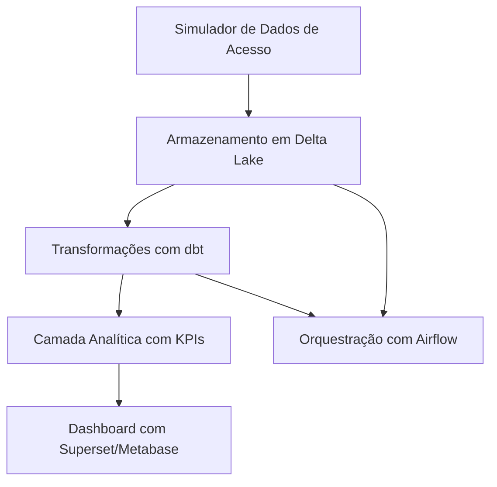

# 🧩 Projeto 1 — G1 Digital (Júnior / Empresa Pequena)

## 📂 Índice
- [Objetivo](#objetivo)
- [Sobre o Negócio](#-sobre-o-negócio)
- [Mapeamento Inicial de Dados](#-mapeamento-inicial-de-dados)
- [Eventos de Negócio que Geram Dados](#-eventos-de-negócio-que-geram-dados)
- [Arquitetura Proposta](#-arquitetura-proposta)
- [Tecnologias Utilizadas](#-tecnologias-utilizadas)
- [Dados Simulados](#-dados-simulados)
- [Camadas de Dados](#-camadas-de-dados)
- [Dashboards](#-dashboards)
- [Execução Local](#-execução-local)
- [Aprendizados Esperados](#-aprendizados-esperados)
- [Inspiração](#-inspiração)

## Objetivo
Simular um pipeline de dados de um portal de notícias (como o G1), com ingestão de logs de acesso e análise de engajamento dos usuários. O projeto tem como foco o domínio de conceitos básicos de Engenharia de Dados: ingestão, transformação, modelagem e visualização.

---

## 📰 Sobre o Negócio
O projeto simula o funcionamento de empresas de newsletters e portais de notícias digitais, como G1 Digital, The News ou The Bizness, que atuam como plataformas de distribuição de conteúdo informativo diretamente ao público, principalmente por meio do email ou acesso via site.

Essas empresas operam com foco em quatro pilares principais:

- **Curadoria e Produção de Conteúdo:** Selecionam, editam ou produzem artigos, notícias, análises e reportagens com base em temas relevantes para sua audiência.

- **Distribuição Multicanal:** Entregam o conteúdo diretamente aos leitores, principalmente via newsletters por email, mas também por aplicativos e sites, segmentando o público por perfil, região ou interesse.

- **Monetização:** Geram receita através de assinaturas pagas, anúncios patrocinados, publieditoriais e parcerias com marcas. A taxa de abertura, cliques e engajamento influencia diretamente a performance comercial.

- **Engajamento e Retenção de Audiência:** Buscam fidelizar seus leitores com conteúdo relevante e constante, monitorando o comportamento do usuário para ajustar suas estratégias editoriais e comerciais.

---

### 📍 Mapeamento Inicial de Dados

Nesta etapa, identificamos os principais pontos de geração e coleta de dados dentro do fluxo operacional do negócio.

| Fonte de Dados                 | Tipo de Dado                                                                 | Origem / Ferramenta               | Frequência      | Formato     |
|-------------------------------|------------------------------------------------------------------------------|-----------------------------------|------------------|-------------|
| Acessos ao site/newsletter    | ID do usuário, timestamp, página acessada, referrer, tempo na página, dispositivo | Logs Web (Apache/Nginx) ou Simulador | Contínua ou Lote | JSON, CSV   |
| Cadastro de usuários          | Nome, email, localidade, dispositivo preferido                               | Base de usuários (CSV/JSON)       | Diária           | CSV, JSON   |
| Conteúdo / Artigos            | ID do artigo, título, autor, categoria, tags                                 | CMS simulado (arquivo estruturado)| Diário           | CSV ou JSON |
| Comentários e engajamento     | ID do comentário, artigo, usuário, texto, data                               | Banco simulado (SQLite, JSON)     | Diária           | CSV, JSON   |
| Métricas de email marketing   | Taxa de abertura, taxa de clique, bounce                                     | Plataforma de envio simulada      | Diária           | CSV         |
| Dados de receita publicitária | Impressões, cliques, valor de anúncio, origem                                | Plataforma de Ads simulada        | Semanal          | CSV, JSON   |

---

### 🔍 Eventos de Negócio que Geram Dados

| Evento no negócio                       | Evento de dado correspondente            | Observação                              |
|----------------------------------------|------------------------------------------|-----------------------------------------|
| Usuário acessa uma notícia             | Log de acesso (`page_view`)              | Inclui device, localização, tempo       |
| Usuário clica em link da newsletter    | Clique de newsletter (`newsletter_click`)| Pode vir da plataforma de email         |
| Artigo é publicado                     | Registro de artigo (`article_published`) | Importado via CMS simulado              |
| Comentário é postado                   | Interação do usuário (`user_comment`)    | Pode conter análise de texto/sentimento |
| Anúncio é exibido ou clicado           | Métrica de Ads (`ad_view`, `ad_click`)   | Relacionado à monetização do conteúdo   |
| Novo cadastro ou assinatura            | Registro de usuário (`user_signup`)      | Geolocalização e dados demográficos     |

---

Essa etapa é essencial para entender:
- Quais dados precisamos simular ou integrar
- De onde vêm os dados no fluxo de negócio
- Como planejar as camadas do pipeline (raw, staging, analytics)

---

## 🏗️ Arquitetura Proposta

---

## 🔧 Tecnologias Utilizadas

  
  
  
  
  
  
  

---

## 🧪 Dados Simulados

**Eventos de Acesso:**
- ID do usuário  
- Timestamp do acesso  
- Página visitada  
- Tempo na página  
- Tipo de dispositivo  

---

## 🧱 Camadas de Dados

- **Raw (Bronze):** Dados brutos simulados salvos em Delta Lake  
- **Staging (Silver):** Dados limpos e estruturados com dbt  
- **Analítica (Gold):** Métricas como:  
  - Tempo médio na página  
  - Páginas mais acessadas  
  - Taxa de rejeição (bounce rate)  

---

## 📊 Dashboards

Exemplos de visualizações:
- Total de acessos por página e por dia  
- Dispositivos mais usados  
- Tempo médio de leitura por seção  

---

## 🚀 Execução Local

Instruções (a serem detalhadas):
1. Clonar o repositório  
2. Instalar os requisitos  
3. Rodar o simulador de dados  
4. Iniciar o Airflow e executar os DAGs  
5. Acessar os dashboards no Superset  

---

## 📌 Aprendizados Esperados

- Organização de camadas de dados (bronze/silver/gold)  
- Automação com Airflow  
- Modelagem e documentação com dbt  
- Visualização de métricas relevantes para o negócio  

---

## 📚 Inspiração

- Portais como G1, BuzzFeed, The News  
- Boas práticas de dados em mídia digital

📄 Documentação Técnica Completa → Acesse em [`/docs`](./docs)

---

Este projeto faz parte do portfólio de transição para Engenharia de Dados de [Natália Guarnieri](https://www.linkedin.com/in/nat%C3%A1lia-andrade-guarnieri-618778262/).

---
📌 [Voltar ao Portfólio Principal](https://github.com/seu-usuario)
