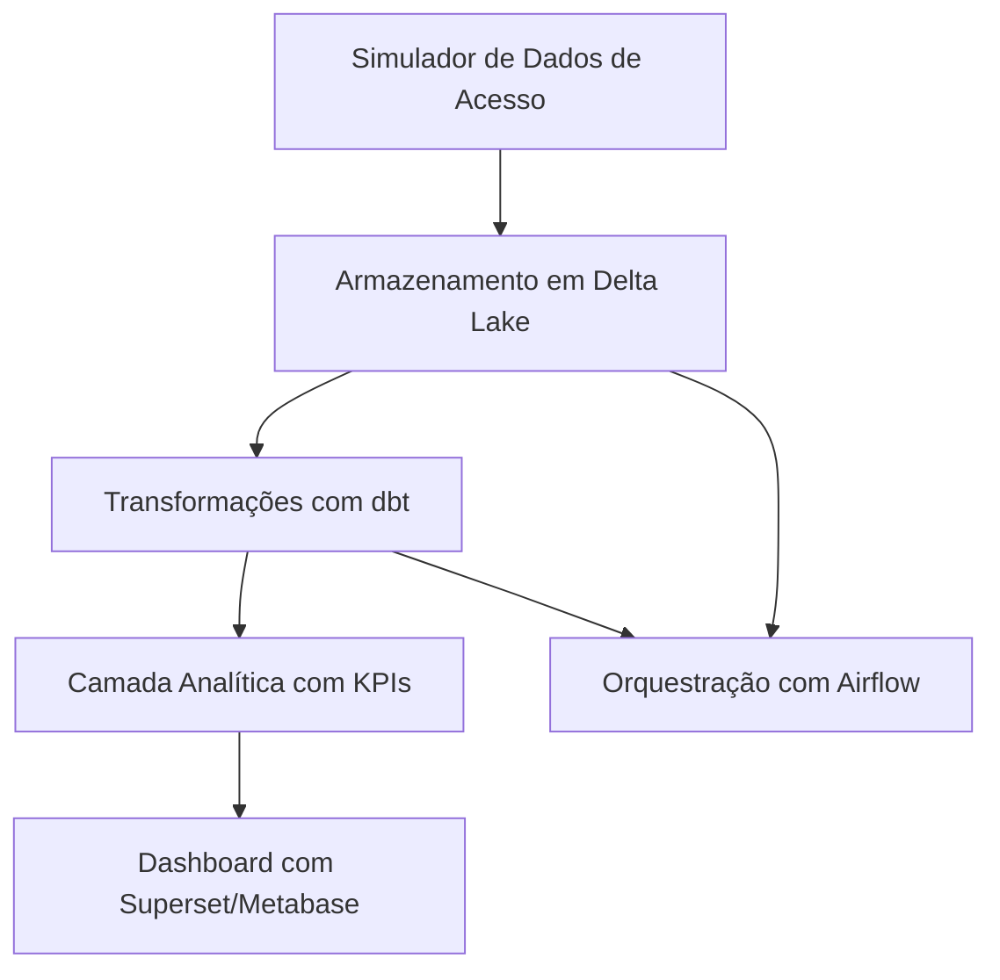

# 🧩 Projeto 1 — G1 Digital (Júnior / Empresa Pequena)

**Objetivo:**  
Simular um pipeline de dados de um portal de notícias (como o G1), com ingestão de logs de acesso e análise de engajamento dos usuários. O projeto tem como foco o domínio de conceitos básicos de Engenharia de Dados: ingestão, transformação, modelagem e visualização.

---

## 🏗️ Arquitetura Proposta

---

## 🔧 Tecnologias Utilizadas

  
  
  
  
  
  
  

---

## 🧪 Dados Simulados

**Eventos de Acesso:**
- ID do usuário  
- Timestamp do acesso  
- Página visitada  
- Tempo na página  
- Tipo de dispositivo  

---

## 🧱 Camadas de Dados

- **Raw (Bronze):** Dados brutos simulados salvos em Delta Lake  
- **Staging (Silver):** Dados limpos e estruturados com dbt  
- **Analítica (Gold):** Métricas como:  
  - Tempo médio na página  
  - Páginas mais acessadas  
  - Taxa de rejeição (bounce rate)  

---

## 📊 Dashboards

Exemplos de visualizações:
- Total de acessos por página e por dia  
- Dispositivos mais usados  
- Tempo médio de leitura por seção  

---

## 🚀 Execução Local

Instruções (a serem detalhadas):
1. Clonar o repositório  
2. Instalar os requisitos  
3. Rodar o simulador de dados  
4. Iniciar o Airflow e executar os DAGs  
5. Acessar os dashboards no Superset  

---

## 📌 Aprendizados Esperados

- Organização de camadas de dados (bronze/silver/gold)  
- Automação com Airflow  
- Modelagem e documentação com dbt  
- Visualização de métricas relevantes para o negócio  

---

## 📚 Inspiração

- Portais como G1, BuzzFeed, The News  
- Boas práticas de dados em mídia digital  

---

Este projeto faz parte do portfólio de transição para Engenharia de Dados de [Natália Guarnieri](https://www.linkedin.com/in/nat%C3%A1lia-andrade-guarnieri-618778262/).
